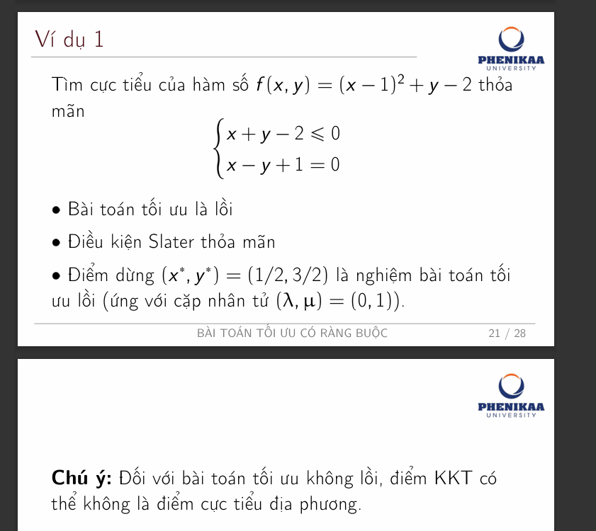
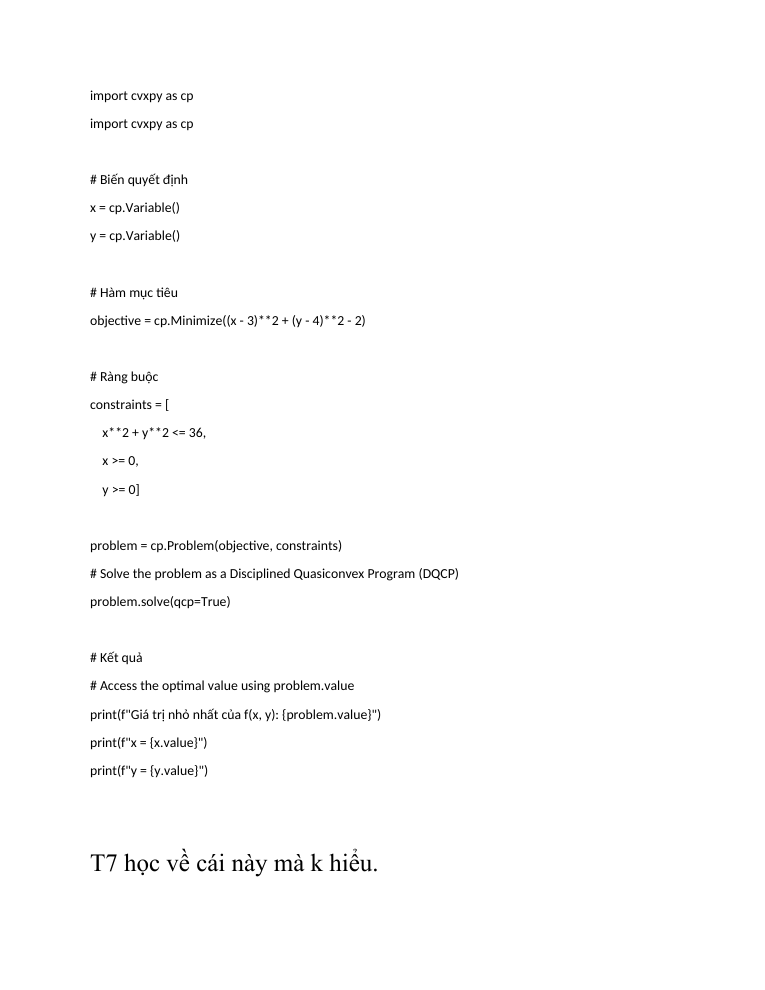
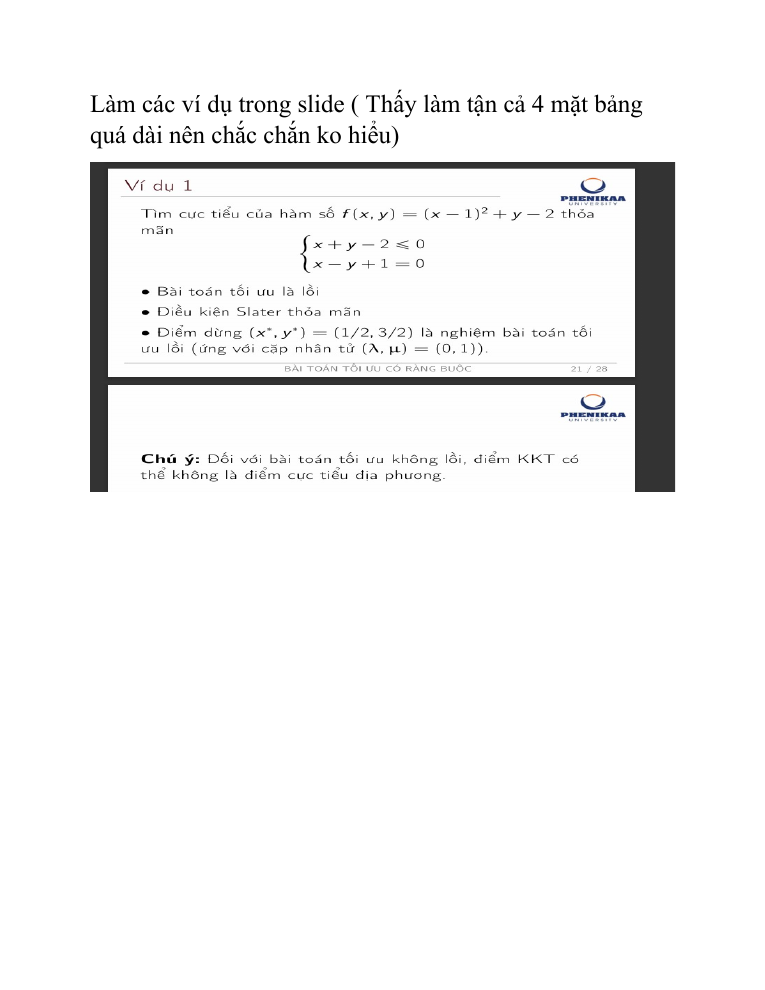

# tam thoi la vay.docx — nội dung đã chuyển sang Markdown

> Nguồn: file Word `tam thoi la vay.docx` (2 trang, 1 ảnh). Chuyển bằng `pandoc` + render trang bằng LibreOffice.

## 1. Đoạn code

```python
import cvxpy as cp

import cvxpy as cp

# Biến quyết định
x = cp.Variable()
y = cp.Variable()

# Hàm mục tiêu
objective = cp.Minimize((x - 3)**2 + (y - 4)**2 - 2)

# Ràng buộc
constraints = [
    x**2 + y**2 <= 36,
    x >= 0,
    y >= 0]

problem = cp.Problem(objective, constraints)

# Solve the problem as a Disciplined Quasiconvex Program (DQCP)
problem.solve(qcp=True)

# Kết quả
# Access the optimal value using problem.value
print(f"Giá trị nhỏ nhất của f(x, y): {problem.value}")
print(f"x = {x.value}")
print(f"y = {y.value}")
```

## 2. Ghi chú trong file

> T7 học về cái này mà k hiểu.
>
> Làm các ví dụ trong slide (Thấy làm tận cả 4 mặt bảng quá dài nên chắc chắn ko hiểu)

## 3. Ảnh trong file

Slide “Ví dụ 1” của bài giảng *Bài toán tối ưu có ràng buộc* (trang 21/28): tìm cực tiểu của f(x, y) = (x − 1)² + y − 2 với x + y − 2 ≤ 0 và x − y + 1 = 0; bài toán lồi, thỏa điều kiện Slater, điểm dừng (x\*, y\*) = (1/2, 3/2) ứng với (λ, μ) = (0, 1). Trang kế tiếp có chú ý: với bài toán không lồi, điểm KKT có thể không là cực tiểu địa phương.



## 4. Ảnh render hai trang của file Word




